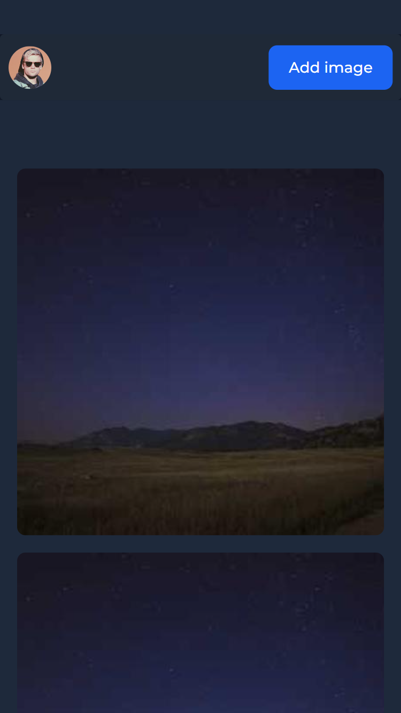

<!-- Please update value in the {}  -->

<h1 align="center">{My Unplash}</h1>

   Solution for a challenge from  <a href="http://devchallenges.io" target="_blank">Devchallenges.io</a>.

  <h3>
    <a href="[https://xxtbmfxx.github.io/](https://unplasgallery.web.app)">
      Demo
    </a>
     | 
    <a href="https://github.com/XxtbmfxX/myunplash">
      Solution
    </a>
     | 
    <a href="https://devchallenges.io/challenges/wBunSb7FPrIepJZAg0sY">
      Challenge
    </a>
  </h3>

<!-- TABLE OF CONTENTS -->

## Table of Contents

- [Overview](#overview)
  - [Built With](#built-with)
- [Features](#features)

<!-- OVERVIEW -->

## Overview

- I try use Formik first but it's much simple to use google for the log in

### Built With

[React](https://es.reactjs.org)
[Vite](https://vitejs.dev)

## Features

<!-- List the features of your application or follow the template. Don't share the figma file here :) -->

This application/site was created as a submission to a [DevChallenges](https://devchallenges.io/challenges) challenge. The [challenge](https://devchallenges.io/challenges/rYyhwJAxMfES5jNQ9YsP) was to build an application to complete the given user stories.

Well thats it not much for now
